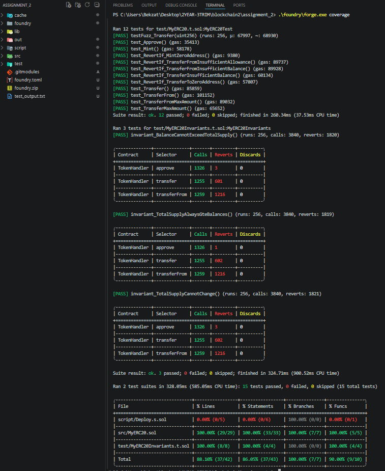
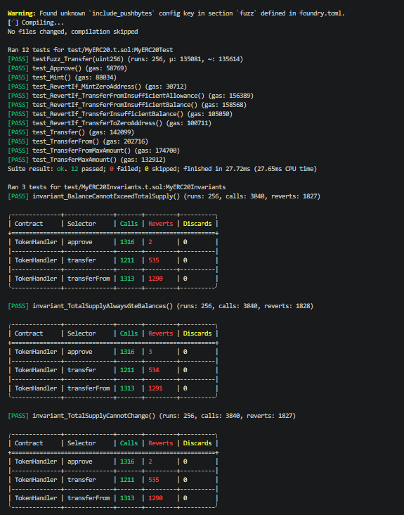
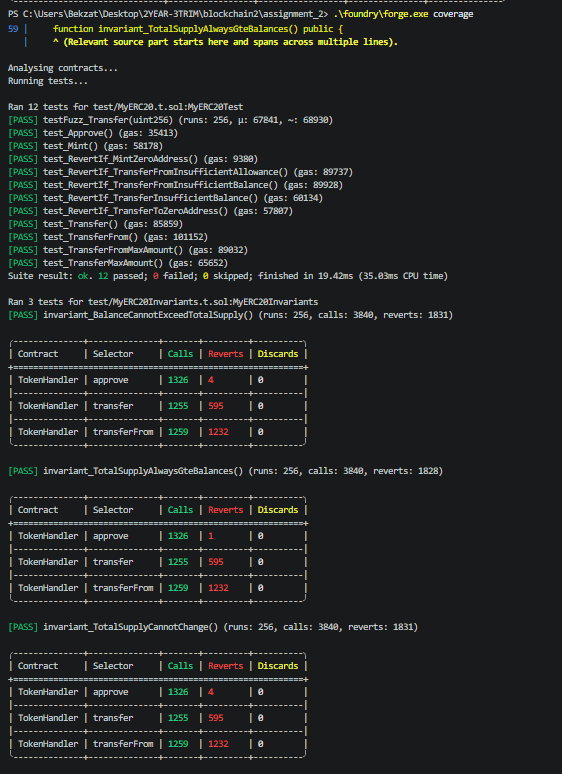
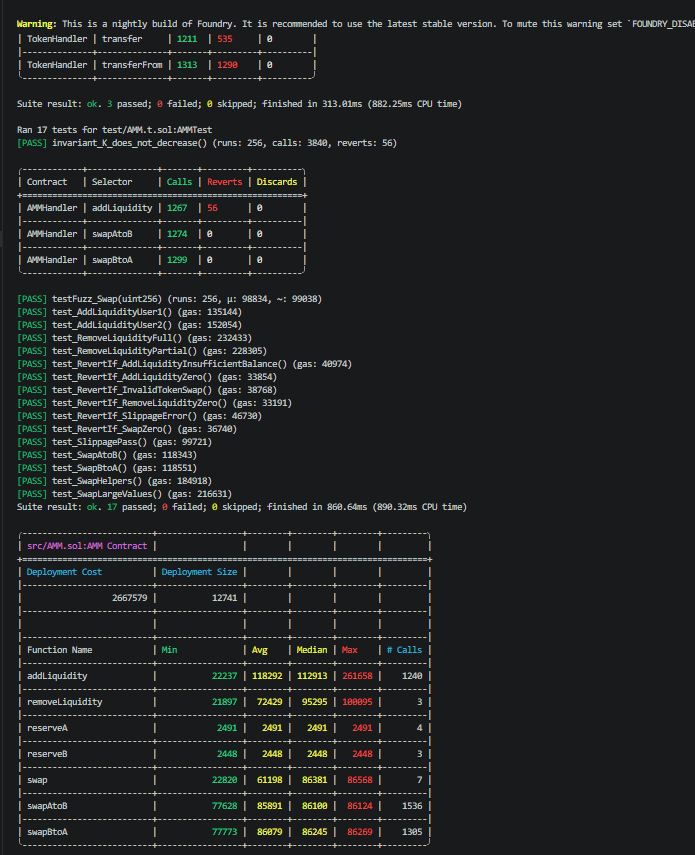
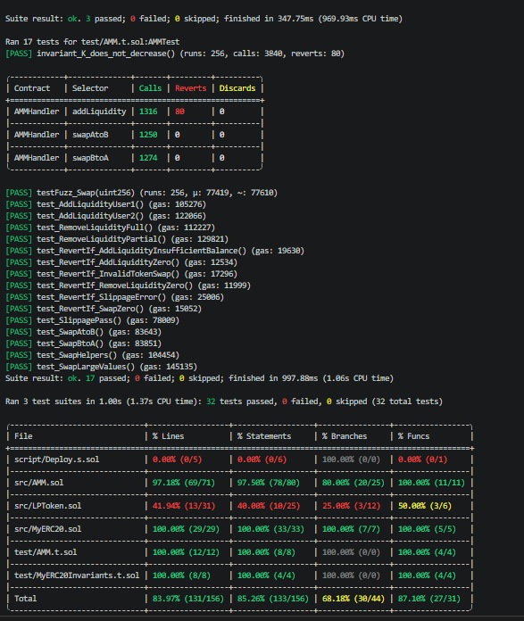
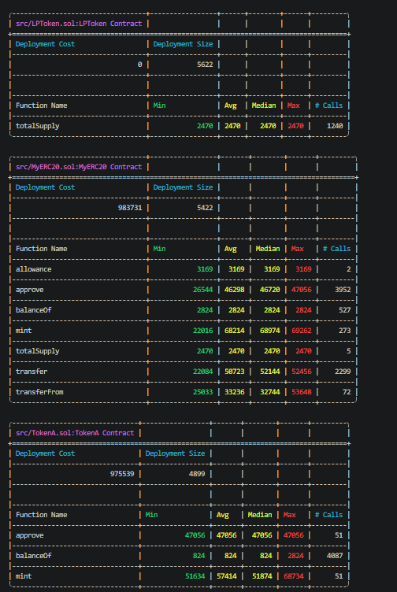
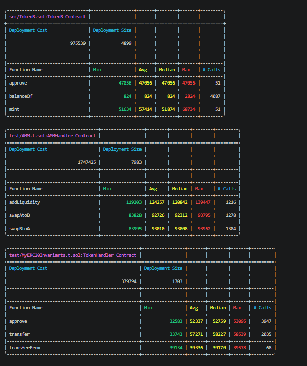
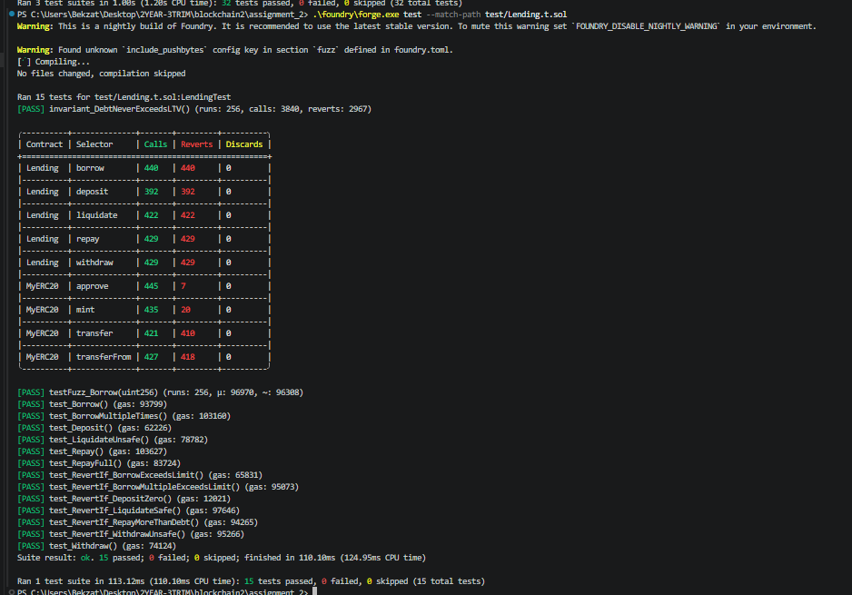
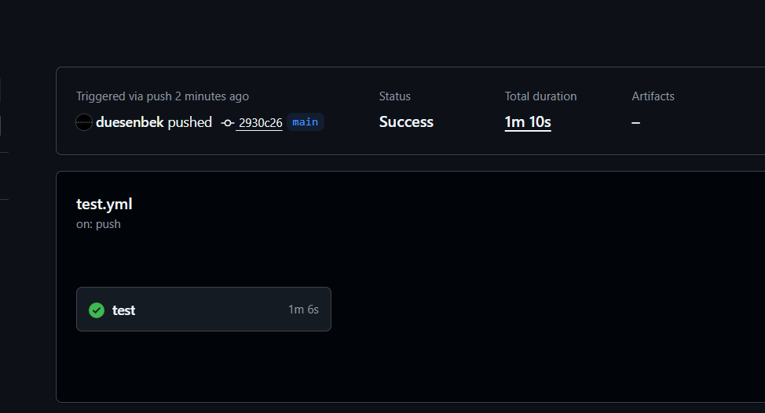

# Assignment 2 — DeFi Protocol (Foundry)

**Student:** Duisenbek Bekzaat  
**Group:** SE-2438  
**Repository:** [github.com/duesenbek/defi-protocol-foundry](https://github.com/duesenbek/defi-protocol-foundry)

---

## Project Structure

```
src/
 ├─ MyERC20.sol        — Custom ERC20 token
 ├─ TokenA.sol         — Token A (inherits MyERC20)
 ├─ TokenB.sol         — Token B (inherits MyERC20)
 ├─ LPToken.sol        — LP token (mint/burn for AMM)
 ├─ AMM.sol            — Uniswap V2 simplified (x*y=k)
 └─ Lending.sol        — Aave simplified (lending protocol)

test/
 ├─ MyERC20.t.sol            — ERC20 unit + fuzz tests (12)
 ├─ MyERC20Invariants.t.sol  — ERC20 invariant tests (3)
 ├─ AMM.t.sol                — AMM unit + fuzz + invariant tests (17)
 └─ Lending.t.sol            — Lending unit + fuzz + invariant tests (15)

script/
 └─ Deploy.s.sol       — Deployment script

.github/workflows/
 └─ test.yml           — CI/CD pipeline
```

**Total tests: 47 — all passed ✅**

---

## PART 1 — ERC20 Token

### Contract: `src/MyERC20.sol`

Custom ERC20 implementation with the following functions:
- `mint(address to, uint256 amount)`
- `transfer(address to, uint256 amount)`
- `approve(address spender, uint256 amount)`
- `transferFrom(address from, address to, uint256 amount)`
- `balanceOf(address)` — public mapping
- `totalSupply()` — public variable

### Tests: 12 unit + fuzz

| # | Test | Type |
|---|------|------|
| 1 | `test_Mint` | Unit |
| 2 | `test_RevertIf_MintZeroAddress` | Unit (edge case) |
| 3 | `test_Transfer` | Unit |
| 4 | `test_RevertIf_TransferInsufficientBalance` | Unit (edge case) |
| 5 | `test_RevertIf_TransferToZeroAddress` | Unit (edge case) |
| 6 | `test_Approve` | Unit |
| 7 | `test_TransferFrom` | Unit |
| 8 | `test_RevertIf_TransferFromInsufficientAllowance` | Unit (edge case) |
| 9 | `test_RevertIf_TransferFromInsufficientBalance` | Unit (edge case) |
| 10 | `test_TransferMaxAmount` | Unit (max uint256) |
| 11 | `test_TransferFromMaxAmount` | Unit (max uint256) |
| 12 | `testFuzz_Transfer(uint)` | Fuzz |

### Invariant Tests: 3

| # | Invariant |
|---|-----------|
| 1 | `invariant_TotalSupplyCannotChange` — totalSupply stays constant after initial mint |
| 2 | `invariant_BalanceCannotExceedTotalSupply` — no balance exceeds totalSupply |
| 3 | `invariant_TotalSupplyAlwaysGteBalances` — sum of balances ≤ totalSupply |

### Screenshot: ERC20 Tests + Coverage







---

## PART 2 — AMM (Uniswap V2 Simplified)

### Contract: `src/AMM.sol`

Simplified Uniswap V2 AMM with constant product formula `x * y = k`.

**Key features:**
- `addLiquidity(uint amountA, uint amountB)` — LP = sqrt(amountA * amountB) for first provider
- `removeLiquidity(uint lpAmount)` — burns LP, returns proportional tokens
- `swap(address tokenIn, uint amountIn, uint minAmountOut)` — 0.3% fee (997/1000)
- `swapAtoB(uint amountIn, uint minAmountOut)` — helper
- `swapBtoA(uint amountIn, uint minAmountOut)` — helper

**Swap formula:**
```
amountOut = (amountIn * 997 * reserveOut) / (reserveIn * 1000 + amountIn * 997)
```

**Slippage protection:**
```solidity
require(amountOut >= minAmountOut, "Slippage error");
```

**Events:**
- `LiquidityAdded(address user, uint amountA, uint amountB)`
- `LiquidityRemoved(address user, uint amountA, uint amountB)`
- `Swap(address user, address tokenIn, uint amountIn, uint amountOut)`

### Tests: 17 (unit + fuzz + invariant)

| # | Test | Type |
|---|------|------|
| 1 | `test_AddLiquidityUser1` | Unit |
| 2 | `test_AddLiquidityUser2` | Unit |
| 3 | `test_RemoveLiquidityPartial` | Unit |
| 4 | `test_RemoveLiquidityFull` | Unit |
| 5 | `test_SwapAtoB` | Unit (A → B) |
| 6 | `test_SwapBtoA` | Unit (B → A) |
| 7 | `test_RevertIf_SlippageError` | Unit (slippage revert) |
| 8 | `test_SlippagePass` | Unit |
| 9 | `test_RevertIf_AddLiquidityZero` | Unit (edge case) |
| 10 | `test_RevertIf_RemoveLiquidityZero` | Unit (edge case) |
| 11 | `test_RevertIf_SwapZero` | Unit (edge case) |
| 12 | `test_SwapLargeValues` | Unit (large values) |
| 13 | `test_SwapHelpers` | Unit |
| 14 | `test_RevertIf_AddLiquidityInsufficientBalance` | Unit (edge case) |
| 15 | `test_RevertIf_InvalidTokenSwap` | Unit (edge case) |
| 16 | `testFuzz_Swap(uint)` | Fuzz |
| 17 | `invariant_K_does_not_decrease` | Invariant (k never decreases) |

### Screenshot: AMM Tests + Gas Report





### Screenshot: Gas Report





---

## PART 3 — Lending Protocol (Aave Simplified)

### Contract: `src/Lending.sol`

Simplified Aave lending protocol.

**Key features:**
- `deposit(uint amount)` — user deposits collateral
- `borrow(uint amount)` — borrow ≤ 75% of collateral (LTV = 75)
- `repay(uint amount)` — repay debt
- `withdraw(uint amount)` — withdraw if position remains safe
- `liquidate(address user)` — liquidate if debt > 75% collateral

**Borrow rule:**
```solidity
uint maxBorrow = (collateral[msg.sender] * LTV) / 100;
require(debt[msg.sender] + amount <= maxBorrow);
```

**Liquidation rule:**
```solidity
require(debt[user] > maxBorrow, "Position is safe");
collateral[user] = 0;
debt[user] = 0;
```

**Events:**
- `Deposit(address user, uint amount)`
- `Borrow(address user, uint amount)`
- `Repay(address user, uint amount)`
- `Withdraw(address user, uint amount)`
- `Liquidate(address user)`

### Tests: 15 (unit + fuzz + invariant)

| # | Test | Type |
|---|------|------|
| 1 | `test_Deposit` | Unit |
| 2 | `test_RevertIf_DepositZero` | Unit (edge case) |
| 3 | `test_Borrow` | Unit (75% max) |
| 4 | `test_RevertIf_BorrowExceedsLimit` | Unit (>75% revert) |
| 5 | `test_BorrowMultipleTimes` | Unit |
| 6 | `test_RevertIf_BorrowMultipleExceedsLimit` | Unit (revert) |
| 7 | `test_Repay` | Unit (partial) |
| 8 | `test_RepayFull` | Unit (full) |
| 9 | `test_RevertIf_RepayMoreThanDebt` | Unit (edge case) |
| 10 | `test_Withdraw` | Unit |
| 11 | `test_RevertIf_WithdrawUnsafe` | Unit (unsafe revert) |
| 12 | `test_LiquidateUnsafe` | Unit (liquidation works) |
| 13 | `test_RevertIf_LiquidateSafe` | Unit (safe → revert) |
| 14 | `testFuzz_Borrow(uint256)` | Fuzz |
| 15 | `invariant_DebtNeverExceedsLTV` | Invariant |

### Screenshot: Lending Tests



---

## PART 4 — CI/CD (GitHub Actions)

### Workflow: `.github/workflows/test.yml`

Pipeline runs automatically on every `push` and `pull_request`.

**Steps:**
1. ✅ **Checkout repo** — with submodules
2. ✅ **Install Foundry** — foundry-toolchain@v1
3. ✅ **Build** — `forge build`
4. ✅ **Run tests** — `forge test` (47 tests passed)
5. ✅ **Coverage** — `forge coverage`
6. ✅ **Slither** — static analysis

### Screenshot: GitHub Actions — Success



---

## Summary

| Part | Component | Tests | Status |
|------|-----------|-------|--------|
| 1 | ERC20 Token | 12 unit + fuzz, 3 invariant | ✅ |
| 2 | AMM (Uniswap V2) | 15 unit, 1 fuzz, 1 invariant | ✅ |
| 3 | Lending (Aave) | 13 unit, 1 fuzz, 1 invariant | ✅ |
| 4 | CI/CD + Slither | GitHub Actions | ✅ |
| **Total** | **3 protocols** | **47 tests** | **✅ ALL PASSED** |
